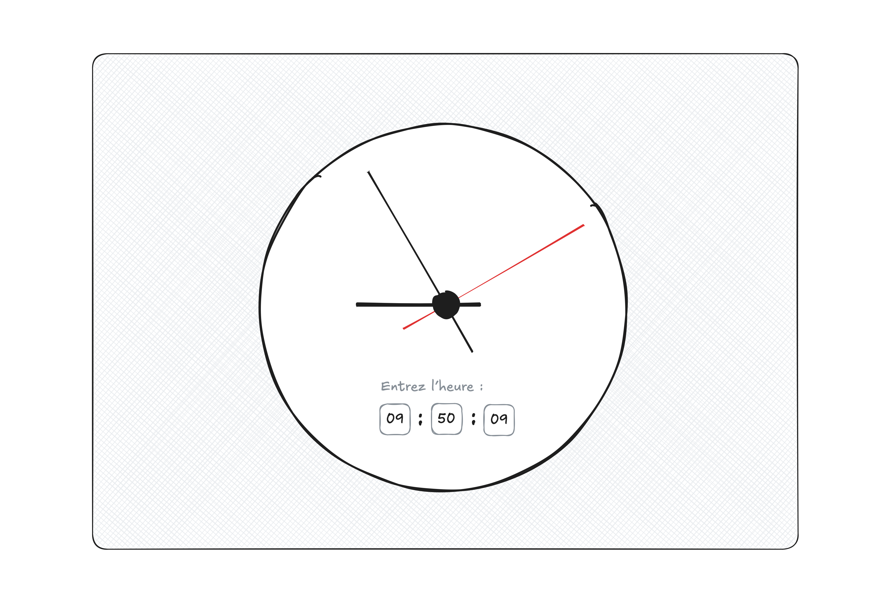

# Devoir 6 : État (suite)

Pour ce devoir, on vous demande de créer une page web qui permet aux
utilisateurs et aux utilisatrices d'entrer une heure digitale, et qui
affiche dynamiquement sa représentation analogue. L'horloge doit avoir
trois aiguilles : une pour les heures, une pour les minutes, et une
autre pour les secondes.

Pour l'horloge, vous pouvez vous inspirez du code [ici][21f].

[21f]:
https://github.com/582-21F-MA/devoirs/tree/main/04_modifier-les-elements/solution
